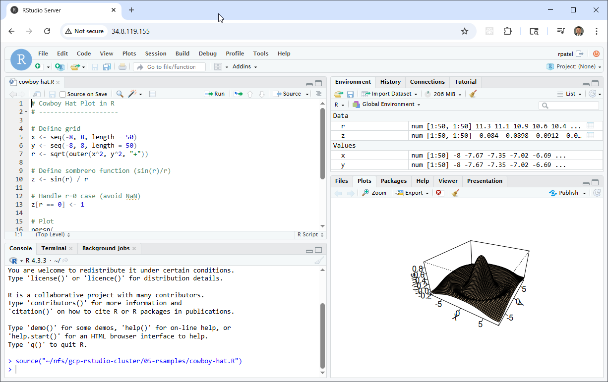
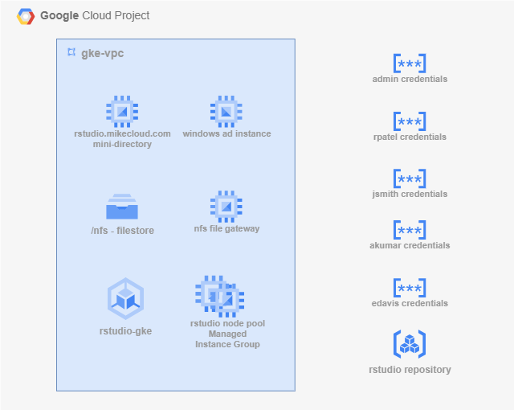
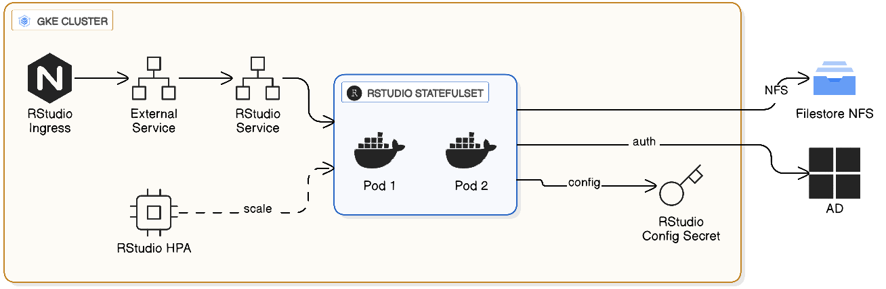
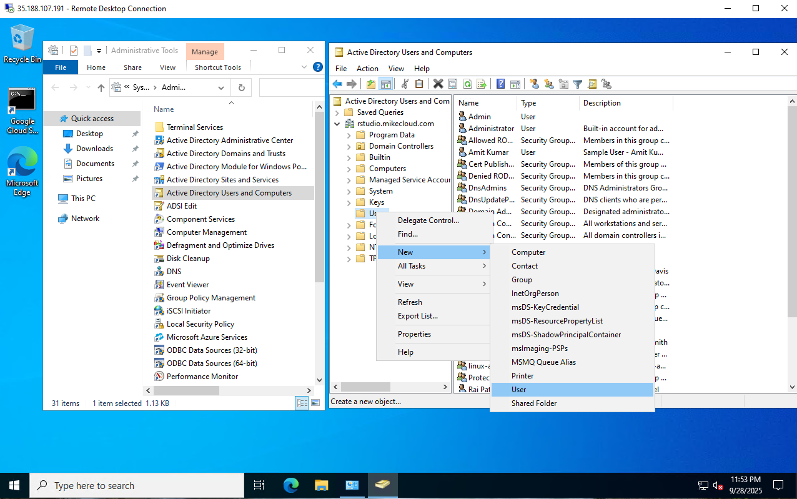
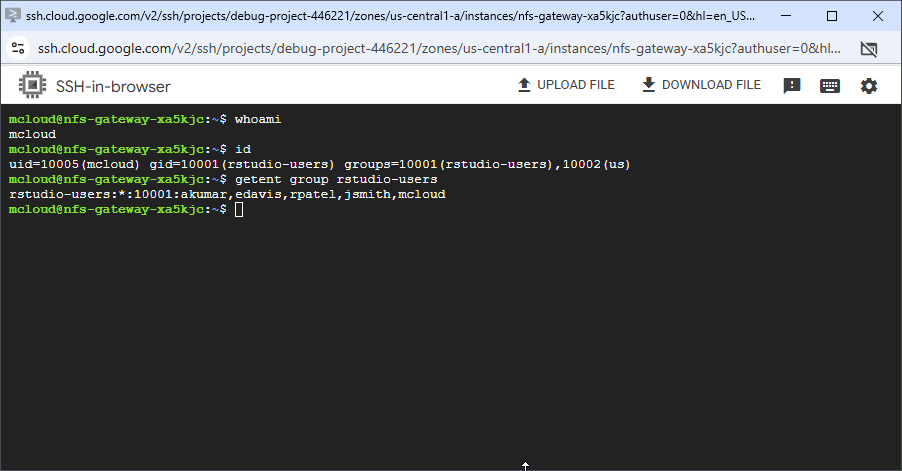

# GCP RStudio Cluster on GKE with Active Directory and NFS Integration

This project builds on both the **GCP Mini Active Directory** and **RStudio VM Cluster** lab components to deliver a **cloud-native, domain-joined RStudio Server environment** running on **Google Kubernetes Engine (GKE)**.



It uses **Terraform**, **Docker**, **Helm**, and **Kubernetes manifests** to create a fully automated analytics platform that integrates with:

- **Active Directory authentication** (via a Samba-based Mini-AD Domain Controller running on GCE)  
- **NFS-backed persistent storage** (via a Linux NFS gateway VM exporting `/nfs/home`, `/nfs/data`, `/nfs/rlibs`)  
- **GKE Workload Identity** for secure, secretless pod-level access to Google APIs such as Secret Manager  
- **Google Artifact Registry (GAR)** for hosting the custom RStudio Server container image  
- A **template-driven Kubernetes manifest (`rstudio-app.yaml`)** rendered by Terraform and applied via `kubectl` to deploy the RStudio StatefulSet, PersistentVolume, PersistentVolumeClaim, Service, and Ingress

Unlike VM-based scaling groups, this solution deploys **containerized RStudio Server pods** on GKE that join the domain at runtime and mount **NFS volumes** for user home directories, project data, and shared R package storage.

Key capabilities demonstrated:

1. **GKE-Hosted RStudio Server** – RStudio Server (Open Source Edition) runs as containers on Google Kubernetes Engine for elasticity, rapid scaling, and resilient self-healing.  
2. **Active Directory Authentication** – Pods authenticate against a Samba-based Active Directory domain, providing consistent identity control across users and sessions.  
3. **NFS Persistent Storage** – User home folders and shared R library paths are mounted from an NFS gateway VM, ensuring cross-pod consistency and reproducible analytics environments.  
4. **NGINX Ingress with Global Static IP** – Provides external access, session affinity, simplified routing, and integration with the GCP external HTTP(S) load balancing stack.  
5. **End-to-End Infrastructure as Code** – Terraform builds the Mini-AD, networking, firewall rules, NFS gateway, Artifact Registry, GKE cluster, Workload Identity bindings, and NGINX ingress; Docker builds the RStudio image; the **Terraform-rendered `rstudio-app.yaml` manifest is applied with `kubectl`** to deploy the complete RStudio workload.

Together, these components form a scalable, domain-aware analytics platform where RStudio users share packages, data, and authentication seamlessly across a fully managed Google Kubernetes environment.



## Prerequisites

* [A Google Cloud Account](https://console.cloud.google.com/)
* [Install gcloud CLI](https://cloud.google.com/sdk/docs/install) 
* [Install Terraform](https://developer.hashicorp.com/terraform/install)
* [Install kubectl](https://kubernetes.io/docs/tasks/tools/)
* [Install Docker](https://docs.docker.com/engine/install/)

If this is your first time watching our content, we recommend starting with this video: [GCP + Terraform: Easy Setup](https://youtu.be/3spJpYX4f7I). It provides a step-by-step guide to properly configure Terraform, Packer, and the gcloud CLI.

## Download this Repository  

Clone the repository from GitHub and move into the project directory:  

```bash
git clone https://github.com/mamonaco1973/gcp-rstudio-gke.git
cd gcp-rstudio-gke
```  


## Build the Code  

Run [check_env](check_env.sh) to validate your environment, then run [apply](apply.sh) to provision the infrastructure.  

```bash
develop-vm:~/gcp-rstudio-gke$ ./apply.sh
NOTE: Validating that required commands are in PATH.
NOTE: gcloud is found in the current PATH.
NOTE: terraform is found in the current PATH.
NOTE: All required commands are available.
NOTE: Checking Google Cloud CLI connection.
NOTE: Successfully authenticated with GCP.
Initializing provider plugins...
Terraform has been successfully initialized!
```  
### Build Results

When the deployment completes, the following resources are created:

- **Networking:**  
  - A custom VPC with segmented subnets for Active Directory, GKE nodes, the NFS gateway VM, and the application tier  
  - Cloud NAT providing controlled outbound internet access for private GKE nodes  
  - Firewall rules allowing SSH, HTTP/HTTPS ingress, NFS (2049/TCP), Kerberos/LDAP, and AD domain join traffic  
  - DNS resolution handled by the Mini Active Directory domain controller and GCP Cloud DNS as needed  

- **Identity, Security & Secret Manager:**  
  - Google Secret Manager storing AD administrator credentials, RStudio service account secrets, and deployment parameters  
  - GKE **Workload Identity** enabling pods to securely access Secret Manager and Google APIs without Kubernetes secrets  
  - IAM bindings granting RStudio pods least-privilege access to GAR, Secret Manager, and logging APIs  
  - Firewall boundaries and IAM scoping enforce secure, segmented communication throughout the environment  

- **Active Directory Domain:**  
  - A Samba-based “Mini-AD” domain controller deployed on a Google Compute Engine VM  
  - Provides Kerberos, LDAP, and DNS services for the cluster  
  - Fully integrated with RStudio pods so users authenticate via domain credentials at login  

- **NFS Persistent Storage:**  
  - A dedicated Linux NFS gateway VM exporting persistent directories including:  
    - User home directories (`/nfs/home`)  
    - Shared data paths (`/nfs/data`)  
    - Shared R library directories (`/nfs/rlibs`)  
  - Firewall rules enforce secure NFS mount traffic between GKE nodes and the gateway VM  
  - Ensures consistent user environments across all RStudio pods  

- **GKE Cluster & Node Pool:**  
  - A Google Kubernetes Engine (GKE) cluster deployed via Terraform  
  - Node pools sized and labeled for RStudio compute workloads  
  - Workload Identity enabled for secure Artifact Registry pulls and Secret Manager access  
  - Autoscaling support ensures efficient, cost-optimized scheduling of RStudio sessions  

- **RStudio Application:**  
  - RStudio Server (Open Source Edition) deployed as a Kubernetes StatefulSet and Service  
  - NGINX Ingress Controller provides the external entrypoint, backed by a reserved Global Static IP  
  - Ingress routing (including `/auth-sign-in`) ensures proper health checks and session management  
  - Pods domain-join at startup and mount **NFS directories** for home folders, shared R packages, and project storage  
  - Provides high availability, reproducibility, and secure multi-user access tied to Active Directory  

- **Automation & Validation:**  
  - Terraform modules orchestrate dependency ordering across networking, directory services, NFS, GKE, and application layers  
  - `apply.sh`, `destroy.sh`, and `validate.sh` automate provisioning, teardown, and endpoint health verification  
  - Validation checks confirm GKE readiness, Ingress provisioning, NFS mounts, Secret Manager access, and successful AD-backed authentication  

- **Sample R Workloads:**  
  - Example R scripts (Monte Carlo simulation, bell-curve plotting, 3D surface rendering, etc.) included for environment verification


### Kubernetes Components




## Users and Groups

The domain controller provisions **sample users and groups** via Terraform templates. These are intended for testing and demonstration.  

### Groups Created  

| Group Name    | Category  | Scope     | gidNumber |
|---------------|-----------|----------|-----------|
| rstudio-users  | Security  | Universal | 10001 |
| india         | Security  | Universal | 10002 |
| us            | Security  | Universal | 10003 |
| linux-admins  | Security  | Universal | 10004 |
| rstudio-admins  | Security  | Universal | 10005 |

### Users Created  

| Username | Full Name   | uidNumber | gidNumber | Groups Joined                    |
|----------|-------------|-----------|-----------|----------------------------------|
| jsmith   | John Smith  | 10001     | 10001     | rstudio-users, us, linux-admins, rstudio-admins  |
| edavis   | Emily Davis | 10002     | 10001     | rstudio-users, us                 |
| rpatel   | Raj Patel   | 10003     | 10001     | rstudio-users, india, linux-admins, rstudio-admins|
| akumar   | Amit Kumar  | 10004     | 10001     | rstudio-users, india              |


### Understanding `uidNumber` and `gidNumber` for Linux Integration

The **`uidNumber`** (User ID) and **`gidNumber`** (Group ID) attributes are critical when integrating **Active Directory** with **Linux systems**, particularly in environments where **SSSD** ([System Security Services Daemon](https://sssd.io/)) or similar services are used for identity management. These attributes allow Linux hosts to recognize and map Active Directory users and groups into the **POSIX** (Portable Operating System Interface) user and group model.

### Creating a New RStudio User

Follow these steps to provision a new user in the Active Directory domain and validate their access to the RStudio cluster:

1. **Connect to the Domain Controller**  
   - Log into the **`win-ad-xxxx`** server via a **RDP** client
   - Use the `rpatel` or `jsmith` credentials that were provisioned during cluster deployment.  

2. **Launch Active Directory Users and Computers (ADUC)**  
   - From the Windows Start menu, open **“Active Directory Users and Computers.”**  
   - Enable **Advanced Features** under the **View** menu. This ensures you can access the extended attribute tabs (e.g., UID/GID mappings).  

3. **Navigate to the Users Organizational Unit (OU)**  
   - In the left-hand tree, expand the domain (e.g., `rstudio.mikecloud.com`).  
   - Select the **Users** OU where all cluster accounts are managed.  

4. **Create a New User Object**  
   - Right-click the Users OU and choose **New → User.**  
   - Provide the following:  
     - **Full Name:** Descriptive user name (e.g., “Mike Cloud”).  
     - **User Logon Name (User Principal Name / UPN):** e.g., `mcloud@rstudio.mikecloud.com`.  
     - **Initial Password:** Set an initial password.



5. **Assign a Unique UID Number**  
   - Open **PowerShell** on the AD server.  
   - Run the script located at:  
     ```powershell
     Z:\nfs\gcp-rstudio-cluster\06-utils\getNextUID.bat
     ```  
   - This script returns the next available **`uidNumber`** to assign to the new account.  

6. **Configure Advanced Attributes**  
   - In the new user’s **Properties** dialog, open the **Attribute Editor** tab.  
   - Set the following values:  
     - `gidNumber` → **10001** (the shared GID for the `rstudio-users` group).  
     - `uid` → match the user’s AD login ID (e.g., `rpatel`).  
     - `uidNumber` → the unique numeric value returned from `getNextUID.ps1`.  

7. **Add Group Memberships**  
   - Go to the **Member Of** tab.  
   - Add the user to the following groups:  
     - **rstudio-users** → grants standard RStudio access.  
     - **us** (or other geographic/departmental group as applicable).  

8. **Validate User on Linux**  
   - Open an **SSH** session to the **`nfs-gateway-xxxx`** instance.  
   - Run the following command to confirm the user’s identity mapping:  
     ```bash
     id mcloud
     ```  
   - Verify that the output shows the correct **UID**, **GID**, and group memberships (e.g., `rstudio-users`).  



9. **Validate RStudio Access**  
   - Open the RStudio cluster’s Application Gateway's URL in a browser (e.g., `http://34.173.20.15/`).  
   - Log in with the new AD credentials.  

10. **Verify Permissions**  
   - By default, the new user is **not** a member of the `rstudio-admin` group.  
   - Attempting to install packages into the **shared library path `/nfs/rlibs`** should fail with a **“Permission denied”** error.  
   - This confirms the user is restricted to installing packages in their **personal user library** only.  

---

✅ **Note:** If you need the user to have administrative rights (e.g., the ability to install packages into the shared library), add them to the **rstudio-admin** group in addition to `rstudio-users`.

### Clean Up  

When finished, remove all resources with:  

```bash
./destroy.sh
```  
